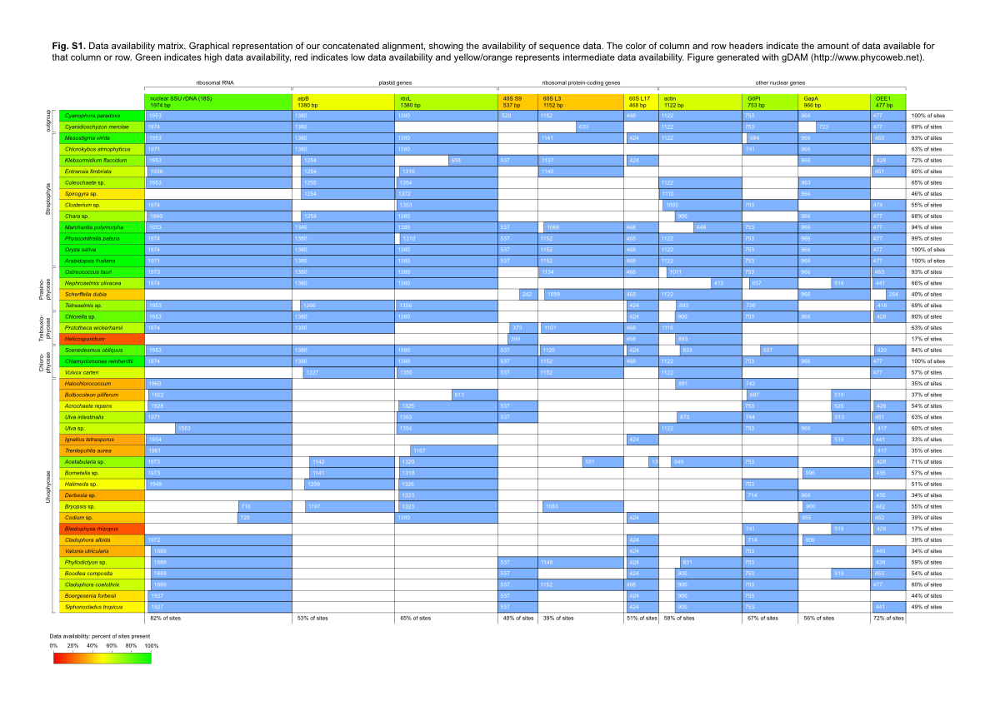

# gDAM
gDAM is a Perl script to generate a graphical table representing data availability in a concatenated sequence alignment. It takes a concatenated alignment as input (nexus format) and generates a graphical table in the SVG (scalable vector graphics) format, which can be imported in most vectorial drawing software. Various data availability statistics are reported and added to the table. If desired, column and row headers are filled with a color indicating the amount of data available for that column or row.
###Example output
Example output produced from a green algal multi-locus alignment.

###Files
The gDAM.pl file is the script to run. I'm also providing an alignment in nexus format (halimeda.nex) as an example for how to format the input.
###Citation
If you find this software useful, please cite it in your work. I recommend citing it as follows:
Verbruggen H. (2011) gDAM: graphical Data Availability Matrix version 1.01. https://github.com/hverbruggen/gDAM
###Notes and disclaimer
gDAM is in development and has not been tested extensively. It is quite plausible that incorrectly formatted input will lead to nonsensical output. In such cases, you should double-check your alignment, compare it to the example alignment and try again. If this still doesn't work, please feel free to write me an email: heroen.verbruggen@gmail.com.
###Dependencies and links
Before running the script, make sure you have these Perl modules installed. They can be obtained from CPAN.
*Graphics::ColorUtils
*SVG